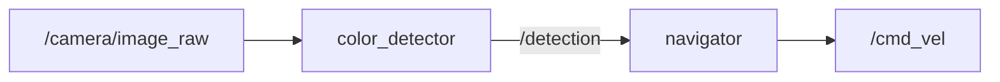

# Visual Servoing for Mobile Robot Goal Seeking

> ROS 2 perception and navigation for a simulated TurtleBot3: detect a green target in the camera feed, steer with proportional control, and approach when aligned.

[](https://docs.ros.org/en/jazzy/)
[](https://opencv.org/)
[](https://gazebosim.org/)
[](https://emanual.robotis.com/docs/en/platform/turtlebot3/overview/)

## Demo

<video src="RobotObjectDetectionAndNavigation.mp4" width="100%" autoplay muted loop playsinline></video>

---

## Table of contents

- [Features](#features)
- [How it works](#how-it-works)
- [Repository layout](#repository-layout)
- [Quick start](#quick-start)
- [Run the stack](#run-the-stack)
- [ROS topics](#ros-topics)
- [Tuning](#tuning)
- [Assignment Q1 (a–i)](#assignment-q1-ai)
- [References](#references)

---

## Features

- **Two-node pipeline** — [`color_detector.py`](src/color_tracker/color_tracker/color_detector.py) (OpenCV on `/camera/image_raw`) and [`navigator.py`](src/color_tracker/color_tracker/navigator.py) (P-control on `/cmd_vel`)
- **Gazebo + TurtleBot3** — simulated burger robot with camera and LiDAR; custom green sphere target in the world
- **Visual approach** — rotate to minimize horizontal error; drive forward when aligned
- **Proximity stop** — contour area threshold + latch so the robot does not creep
- **Recovery** — when the target leaves the frame, rotate toward the last-seen side; after 1.5 s with no detection, slow full search spin

`ROS2` · `OpenCV` · `Gazebo` · `TurtleBot3` · `Computer Vision`

---

## How it works



1. **Detect** — HSV green threshold → morphology → contours → pick most circular blob → centroid & horizontal error vs image center.
2. **Steer** — `angular.z = Kp × error` (clamped).
3. **Approach** — if `|error| < threshold`, publish forward linear velocity.
4. **Stop** — if contour area ≥ `stop_area` and target is centered, latch stop.
5. **Recover** — if lost, use `last_dir` (+1 left / −1 right); on timeout, spin to search.

---

## Repository layout

```
robot-perception-and-navigation/
├── README.md
├── RobotObjectDetectionAndNavigation.mp4
└── src/
    └── color_tracker/
        ├── package.xml
        ├── setup.py
        └── color_tracker/
            ├── color_detector.py
            └── navigator.py
```

---

## Quick start

> [!NOTE]
> Tested on **Ubuntu 24.04** with **ROS 2 Jazzy**. Gazebo and TurtleBot3 simulation packages are required.

### 1. Install dependencies

```bash
sudo apt update
sudo apt install ros-jazzy-turtlebot3 ros-jazzy-turtlebot3-gazebo ros-jazzy-cv-bridge
sudo apt install python3-opencv python3-numpy
```

Add to `~/.bashrc`:

```bash
export TURTLEBOT3_MODEL=burger
source /opt/ros/jazzy/setup.bash
```

### 2. Clone and build

```bash
git clone https://github.com/harshgupta1064/robot-perception-and-navigation.git
cd robot-perception-and-navigation
colcon build --packages-select color_tracker
source install/setup.bash
```

### 3. Green sphere in Gazebo

Add a static green sphere SDF to your world (in front of the robot, ~1–2 m, in camera view):

```xml
<model name="green_sphere">
  <static>true</static>
  <link name="link">
    <visual name="visual">
      <geometry><sphere><radius>0.15</radius></sphere></geometry>
      <material>
        <ambient>0 1 0 1</ambient>
        <diffuse>0 1 0 1</diffuse>
      </material>
    </visual>
  </link>
</model>
```

---

## Run the stack

Open **three terminals** (source ROS + workspace in each).

| Terminal | Command |
|----------|---------|
| **1 — Simulation** | `ros2 launch turtlebot3_gazebo turtlebot3_world.launch.py` |
| **2 — Vision** | `ros2 run color_tracker color_detector` |
| **3 — Navigation** | `ros2 run color_tracker navigator` |

<details>
<summary>Full commands (copy-paste)</summary>

**Terminal 1**

```bash
export TURTLEBOT3_MODEL=burger
source /opt/ros/jazzy/setup.bash
ros2 launch turtlebot3_gazebo turtlebot3_world.launch.py
```

**Terminal 2**

```bash
source /opt/ros/jazzy/setup.bash
source install/setup.bash   # from repo root
ros2 run color_tracker color_detector
```

**Terminal 3**

```bash
source /opt/ros/jazzy/setup.bash
source install/setup.bash
ros2 run color_tracker navigator
```

</details>

**Debug**

```bash
ros2 topic list
ros2 topic echo /detection
ros2 topic echo /cmd_vel
```

---

## ROS topics

| Topic | Type | Node | Description |
|-------|------|------|-------------|
| `/camera/image_raw` | `sensor_msgs/Image` | `color_detector` | Sub — camera feed |
| `/detection` | `std_msgs/Float32MultiArray` | both | Pub/sub — `[error, detected, area, last_dir]` |
| `/cmd_vel` | `geometry_msgs/TwistStamped` | `navigator` | Pub — velocity commands |

**`/detection` layout**

| Index | Field | Meaning |
|-------|--------|---------|
| `0` | `error` | Horizontal pixel error (image center − centroid) |
| `1` | `detected` | `1.0` if target found, else `0.0` |
| `2` | `area` | Contour area (distance proxy) |
| `3` | `last_dir` | `+1` = last seen left, `-1` = right (recovery) |

---

## Tuning

Parameters in [`navigator.py`](src/color_tracker/color_tracker/navigator.py):

| Parameter | Default | Role |
|-----------|---------|------|
| `Kp` | `0.005` | Heading P-gain |
| `error_threshold` | `25` px | Allow forward motion when `\|error\|` below this |
| `linear_speed` | `0.15` m/s | Approach speed |
| `stop_area` | `400000` | Stop when contour area exceeds this |
| `recovery_speed` | `0.35` rad/s | Search rotation |
| `timeout_sec` | `1.5` s | No detection → full slow spin |

HSV bounds and circularity filter: [`color_detector.py`](src/color_tracker/color_tracker/color_detector.py).

---

## Assignment Q1 (a–i)

Peppermint Assignment — **Color-based navigation with ROS 2 and OpenCV**.

<details>
<summary><b>(a)–(e) Implementation checklist</b></summary>

| Task | Implementation |
|------|----------------|
| **(a)** TurtleBot3 Gazebo + green sphere | `turtlebot3_gazebo` + green sphere SDF in world |
| **(b)** Subscribe to camera | `/camera/image_raw` in `color_detector.py` |
| **(c)** OpenCV threshold, contour, error | HSV, morphology, circularity, centroid error |
| **(d)** P-controller rotation | `angular.z = Kp * error` in `navigator.py` |
| **(e)** Move when aligned | Forward when `\|error\| < error_threshold` |

</details>

<details>
<summary><b>(f) Object out of frame — recovery</b></summary>

When the sphere leaves the frame, `detected` becomes `0.0`:

1. **Directional search** — rotate toward the side where the target was last seen (`last_dir`), instead of a blind 360° spin.
2. **Timeout** — if nothing is detected for **1.5 s**, perform a slow full search spin.

</details>

<details>
<summary><b>(g) Proximity and stop</b></summary>

**Implemented:** contour **area** as a distance proxy (closer → larger blob). Stop when `area ≥ stop_area` and the target is centered; **latch** prevents creep from noise.

**Alternative:** use TurtleBot3 **LiDAR** (`/scan`) — stop when forward range &lt; ~0.3 m for lighting-independent, metric stopping.

</details>

<details>
<summary><b>(h) Lidar-only navigation</b></summary>

Without color:

1. **Cluster** scan/point-cloud hits into objects.
2. **RANSAC sphere fit** — LiDAR only sees the front surface (partial spherical cap). Sample 3 points → hypothesize sphere → count inliers; repeat ~100–200×. Spheres score high; pillars/cylinders score low.
3. **Steer** — bearing to cluster center = angular error → P-control.
4. **Range** — direct from LiDAR (no area proxy).
5. **Recovery** — 360° FOV; target rarely “out of frame” unless behind a wall.

</details>

<details>
<summary><b>(i) Follow only the sphere among other shapes</b></summary>

Run RANSAC sphere fitting **per cluster**; pick the cluster with the highest inlier ratio, then steer and approach using its bearing and range (same as (h)).

</details>

---

## References

| Resource | Link |
|----------|------|
| TurtleBot3 e-Manual | https://emanual.robotis.com/docs/en/platform/turtlebot3/ |
| ROS 2 Jazzy | https://docs.ros.org/en/jazzy/ |

---

## Author

**[Harsh Gupta](https://github.com/harshgupta1064)** — [@harshgupta1064](https://github.com/harshgupta1064)
